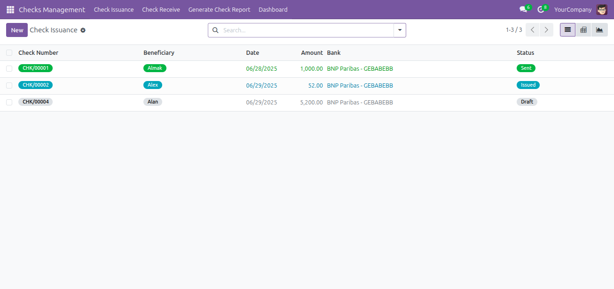
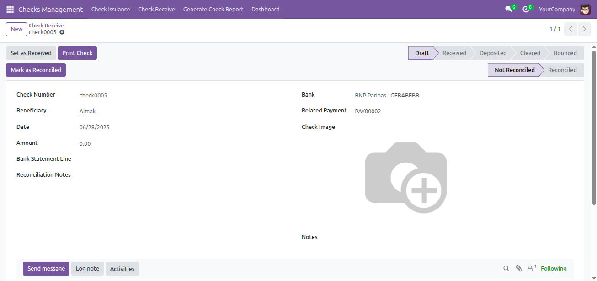
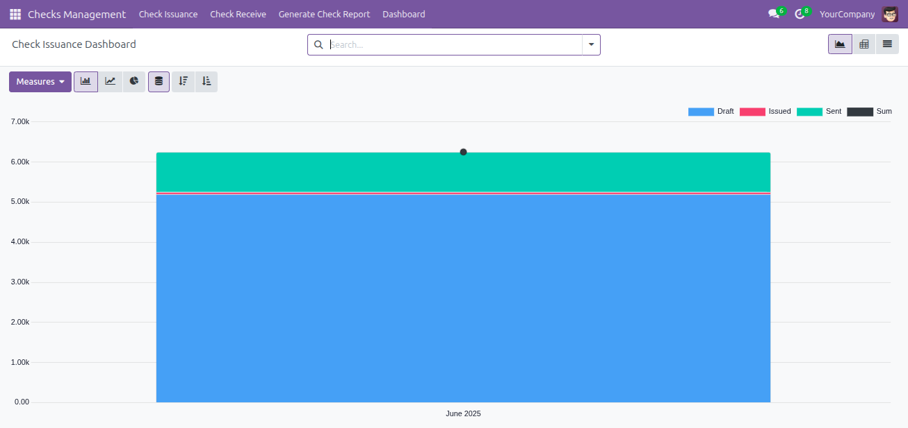
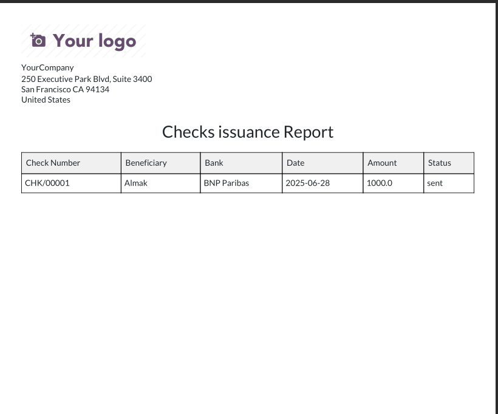
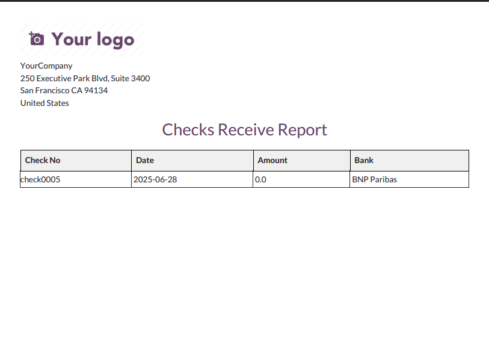

  

# Checks Management

This Odoo module provides a **comprehensive system to manage the issuance and receipt of checks**, track their lifecycle, and generate analytical reports and reminders.

---

## 🚀 Features

✅ **Issuing Checks**
- Create and manage issued checks with states: *Draft, Issued, Sent*.
- Automatically assign unique check numbers.
- Generate PDF check issuance reports.
- Smart buttons for related activities and attachments.

✅ **Receiving Checks**
- Register received checks with lifecycle tracking: *Draft, Received, Deposited, Cleared, Bounced*.
- Record check images and notes.
- Reconciliation status management (Not Reconciled, Reconciled).
- Automated reminders for due and overdue checks via scheduled cron jobs.

✅ **Dashboards & Analysis**
- Analytical dashboards for both issuing and receiving checks.
- Pivot tables and graph views with grouping by date, beneficiary, and status.
- Decorated list views with colored status indicators.

✅ **Reporting**
- Printable PDF reports for issuance and receiving.
- Wizards to generate reports and process checks in batch.

✅ **Security & Access Control**
- Role-based access (e.g., Finance Manager permissions).
- Record rules restricting access to authorized users.

✅ **Integrations**
- Full integration with:
  - Accounting
  - Mail (chatter, activities)

---

## 📊 Dashboards

Two built-in dashboards:
- **Issuing Checks Dashboard**: Analyze issued checks by amount, state, and beneficiary.
- **Receiving Checks Dashboard**: Visualize received checks lifecycle and reconciliation status.

---

## 📷 Screenshots

Below are example views from the Checks Management module.

### Issued Checks List View

---

### Received Checks Form View

---

### Analytical Dashboard

---

### Check Issuance PDF Report

---

### Check Receive PDF Report

---

## 🛠 Installation

1. Clone this repository into your Odoo `addons` directory.
2. Update the Apps List:
3. Install the **Checks** module.

---

## 🧩 Dependencies

- **base**
- **account**
- **mail**

---

## 🔄 Scheduled Actions

This module includes an automatic cron job:
- **Check Due Reminder**: Notifies you daily about checks that are due or overdue.

---

## 📝 License

This module is licensed under LGPL-3.

---

## 🌐 Support

For questions, customization, or support, contact your Odoo administrator or development partner.
**Net4X Innovation**  
🌐 [https://net4x-innovation.com](https://net4x-innovation.com/contactus)