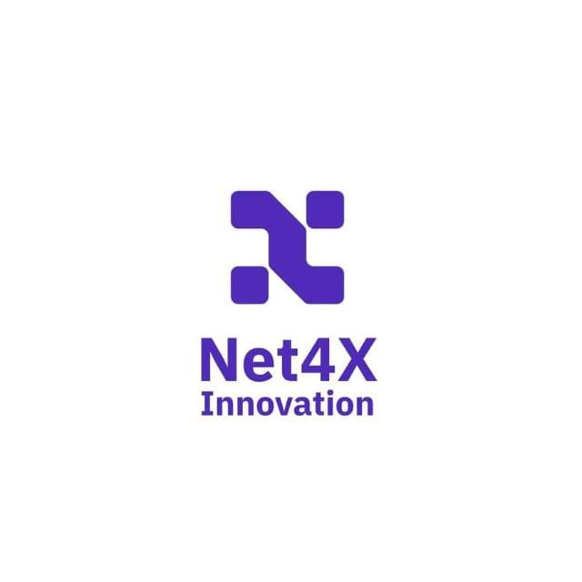

<p align="right">
  
</p>

# Custom Expense Portal

**Version:** 18.0.1.0  
**Author:** Net4X Innovation  
**Website:** [https://net4x-innovation.com](https://net4x-innovation.com)

## Overview

The **Custom Expense Portal** is an Odoo module designed to streamline the process of submitting, tracking, and managing employee expenses for small to medium businesses. It provides employees with an easy-to-use portal for submitting expenses and enables managers to approve or reject them with minimal effort.

## Key Features

- Employee portal for submitting expenses
- Manager approval workflow
- Real-time balance tracking
- Custom PDF report generation
- Role-based access control
- Integration with accounting (`account`) and HR expense (`hr_expense`) modules

## Installation

1. Download or clone this module into your Odoo custom addons directory.
2. Update the Odoo apps list:
   ```
   ./odoo-bin -u all
   ```
3. Locate **Custom Expense Portal** in the Apps menu and click "Install".

## Configuration

- Assign appropriate access rights to employee and manager groups via **Settings > Users & Companies > Groups**.
- Customize reports or views as needed in the technical settings.

## Dependencies

- `hr_expense`
- `account`


## License

This module is licensed under the **LGPL-2**. See [LICENSE](https://www.gnu.org/licenses/old-licenses/lgpl-2.0.html#license-text) for full details.

## Support

For support or custom development, contact us at:

**Net4X Innovation**  
🌐 [https://net4x-innovation.com](https://net4x-innovation.com/contactus)
