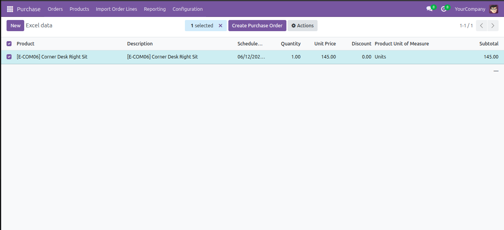
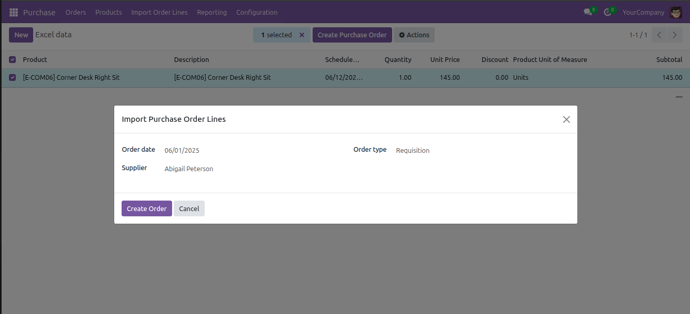
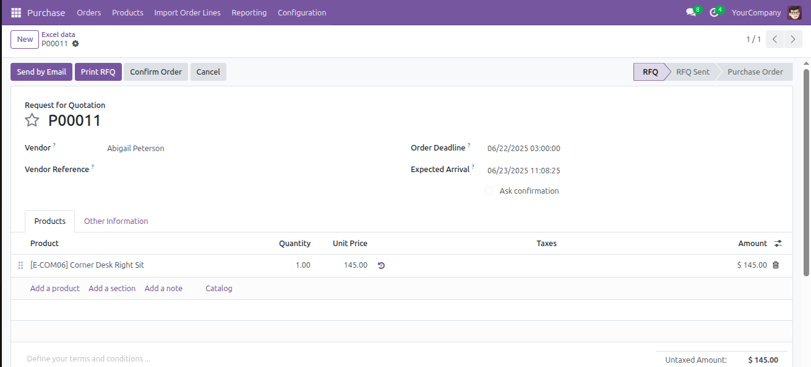

  

# Purchase Lines Import

**Version:** 18.0.1.0  
**Author:** [Net4X Innovation](https://net4x-innovation.com/)  
**License:** AGPL-3  

## 📦 Summary

This module adds a custom feature to **import purchase order lines from Excel files** in Odoo.

## 🚀 Features

- Import bulk product lines into Purchase Orders.
- Automatically create a Purchase Order by selecting:
  - Vendor
  - Order date
  - Order type
- Simplifies data entry for long purchase lists.
- Supports form and tree views for easy management.
- Includes wizard to upload and process Excel files.

## 🧩 Dependencies

- `purchase`
- `account`

## 🔐 Access Control

Includes model access rights configured via:
- `ir.model.access.csv`

## 📁 Included Files

- Views:
  - `product_lines_migration_view.xml`
- Security:
  - `ir.model.access.csv`

## ✅ Installation

1. Copy the module folder to your Odoo `addons/` directory.
2. Update the Apps list.
3. Search for **"Purchase Lines Import"** and install it.

## 📝 Usage

1. Go to **Purchases > Import Order Lines**.
2. Open the wizard.
3. Select:
   - Order date
   - Supplier
   - Order type
   - Upload your Excel file
4. Click **Create Order**.

##  📸 Screenshots

### 📥 Import Wizard

### 📝 Before Creating Order

### ✅ Final Created Purchase Order

## 📃 License

This module is licensed under the **AGPL-3** license.