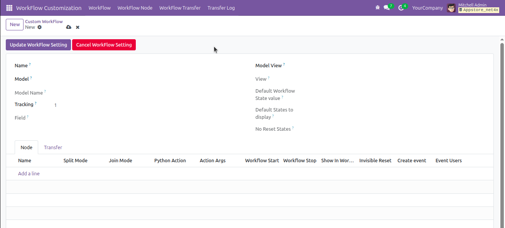
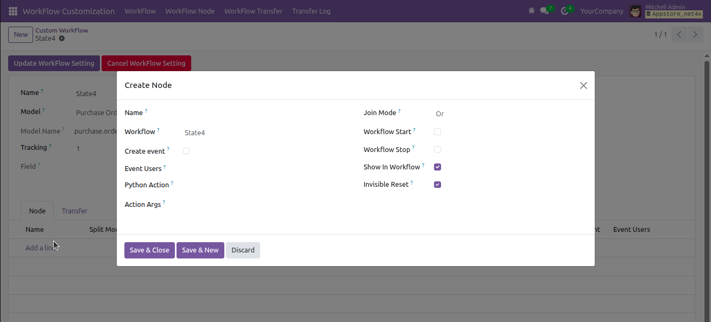
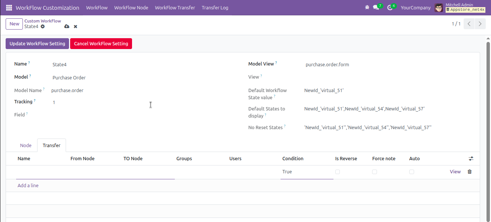
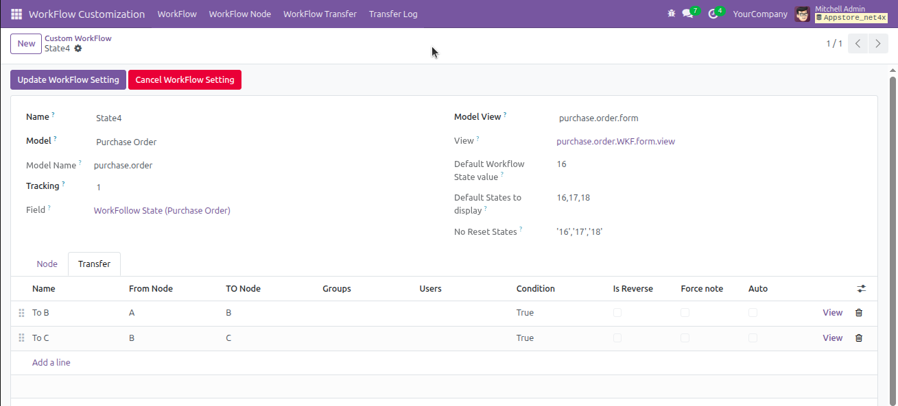
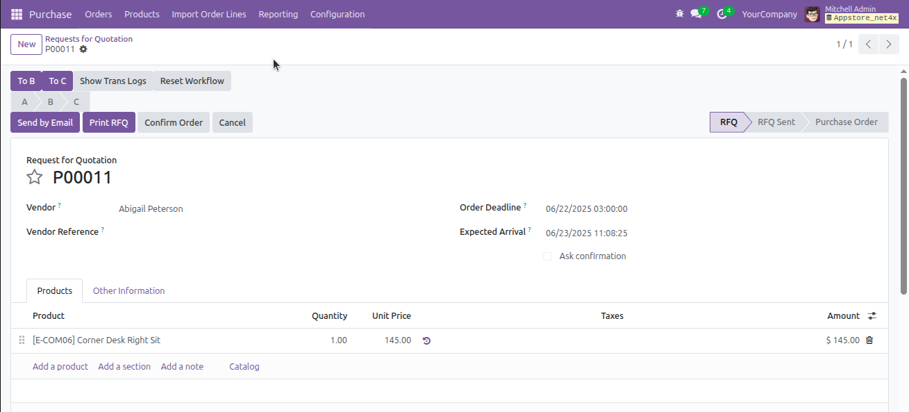
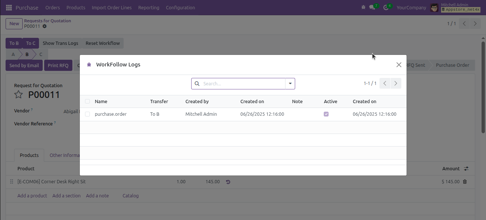

  

# Workflow Customization

**Version:** 18.0.1.0  
**Author:** [Net4X Innovation](https://net4x-innovation.com/)  
**License:** AGPL-3

## ✅ Summary

Advanced Workflow Enhancements and Tools for Odoo Users and Developers

## 📋 Description

The **Workflow Customization** module is a utility toolkit for Odoo developers and power users to streamline custom
workflow creation and object state control. It introduces reusable tools to manage record lifecycle actions such as
confirmations, validations, archiving, and logging — without having to redefine them in every model.

## 🧩 Key Features

- Generic button generator to execute actions like "confirm", "approve", "validate", "done", etc.
- Wizard for dynamic state changes (e.g., change state to a specific value with reason).
- A utility to archive and unarchive records programmatically.
- XML templates for reusing workflow button layouts across multiple views.
- Supports developer-defined transitions and labels via inherited models.
- Adds developer utilities for improved debugging and control.

## 🧠 Use Cases

- Add "Confirm" and "Done" buttons to any model without redefining them in each view.
- Allow users to update workflow state manually with traceable notes.
- Accelerate the creation of approval workflows in HR, Sales, or Custom Apps.
- Help developers quickly plug standardized transitions across modules.

## 📸 Screenshots

### ✅ 1.Create Statusbarview

### ✅ 2.Create Nodes

### ✅ 3.Create Transfer

### ✅ 4.Click Update Workflow Button

### ✅ 5.Move To The Form

### ✅ 6.Show Trans Log Button

## 🔧 Compatibility

- Odoo Version: 18.0
- License: LGPL-3
